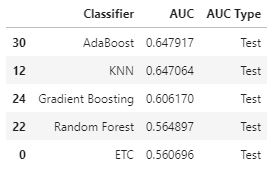

# Crude Oil Price Prediction

---

### Key Objective
Could we predict the daily price of oil into the future by indentifying correlated data.

### Data Acquisition
We used historical front month Crude Oil Futures contracts as our primary source of data.  We broke up the data acquisition into three categories: supply, demand, and other as seen in the table below.

|        | Data          | Source |
| --     | ---           | ---    |
| Primary|               |        |
|        |Crude Oil      |Yahoo Finance    |
| Supply |               |        |
|        |Oil Production |OECD    |
| Demand |               |        |
|        |Housing Starts |Macrotrends.net    |
|        |GDP            |Macrotrends.net    |
| Other  |               |        |
|        |Tweets         |Twitter    |
|        |Dollar Bullish Index(UUP)|Yahoo Finance    |

We selected the UUP because crude oil is priced in dollars and bought/sold with dollars. The UUP weights the dollar against a basket of currencies from the largest economies of the world.

We gather ~3200 tweets per user for the top 10 oil industry experts as rated by a 2015 article from Benzinga.com and a 2019 article from Offshore-Technology.com.  We used these tweets to perform Vader and Textblob sentiment analysis which would be used as a feature in our models.

### Correlation
Once data was acquired and prepped we looked for correlations between crude oil prices and the other data.  We did this by performing an ADfuller test, plotting each dataset along with crude oil(see images below), and performing a time-series analysis with a recurrent neural network.

(Crude Oil is plotted in red and the feature data is ploted in blue.)

All of these resulted in showing no trend or ability to see a pattern in which to predict the price of crude oil.

Do to this finding we decided to treat this as a classification problem and we adjusted our objective to just trying to predict whether the price would go up or down.

### Classification Problem
To work this as a classification problem we found code that we adjusted to work with our datasets, instead of randomly generated data, that would iterate over multiple classifiers(listed below) as well as multiple parameters for each of those classifiers. The code also used Recursive feature elimination with cross validation to provide feature importance scores and best parameters scoring for each classifier that would be used to produce a performance(AUC) curve scores and to grade each classifier's precision.

|   |   |
|--|--|
| Linear Discriminant Analysis | Quadratic Discriminant Analysis|
|AdaBoost Classifier|Bagging Classifier
|Extra Trees Classifier|Gradient Boosting Classifier
|Random Forest Classifier|Ridge Classifier
|SGD Classifier|Bernoulli NB
|Gaussian NB|K-Neighbors Classifier
|MLP Classifier|Linear SVC
|NuSVC|SVC
|Decision Tree Classifier|ETC

### Random Forest as Basline Model
We used the random forest model as our baseline(this was randomly choosen). The AUC curve plot showed that there were no additional benefits to using more than 2 features in our model and the top 2 features were the oil production and UUP data.  

---

All of the classifiers were ran using just the top 2 features instead of the 5 beginning features to see if the models would perform better.  Below shows the AUC scores for the top 5 performing models.

Since getting the direction correct was most important to the objective we looked at the precision scores for the top 2 performing models.

|| |

### Recurrent Neural Network Model, Evaluation and Performance
Along with the standard machine learning models we also ran a recurrent neural network model. This stack consists of two machine learning models: Recurrent Neural Network(RNN) and Random Forest(RN).This is shown in the image below.

 First we ran the RNN for each individual feature: historical prices, GDP, production, twitter vader and textblob sentiment analysis, and UUP to get the predicted prices from each dataset. Then convert the preciated prices to up/down trend and use as input for the RF model to walk all the decision trees to find the best output of the up/down trend. The advantage of the stacked model is: the RNN will use the recurrent signal from each individual featured input dataset, and the RN will find out the best result by polling all possibilities.

 There were a total of five predicted price curves in the program (one for each dataset). Below is a full plot of one of those predicted prices.

Below is zoomed in on the above plot to show a closer look at the up/down predicted values(in purple) against the actual up/down values(in green)

For this example our accuracy score was 0.58.  We saw that this model was more accurate at predicting when crude oil price was going to go down.

### Final Thoughts
We need to do better at understanding whether the data is just correlated or is actually casually correlated or at least a leading indicator to our data’s movement--otherwise the correlation is useless for predicting future price.

We need to define whether our data is linear or nonlinear and run it with the appropriate models.  RNN may work for nonlinear data but was not useful for our linear data.

Finally, we had model results that were almost as good as the daily data when the models were ran with monthly data.  We need to better understand how this might fit into a predictive model.  If it is possible to predict up or down for the month this might have better value than predicting only daily moves.

---
##### Project Team Members
- Jimmy McClure
- Weidong Li
- Brett Aucoin

##### Technologies Used
- Python 3
- Python libraries (yfinance, tweepy)
- Machine Learning (classification, linear Regression, recurrent neural network)
- Plotting (seaborn, Matplotlib plotly)
- Sentiment Anlaysis (vader, textblob)
- API (Twitter) 